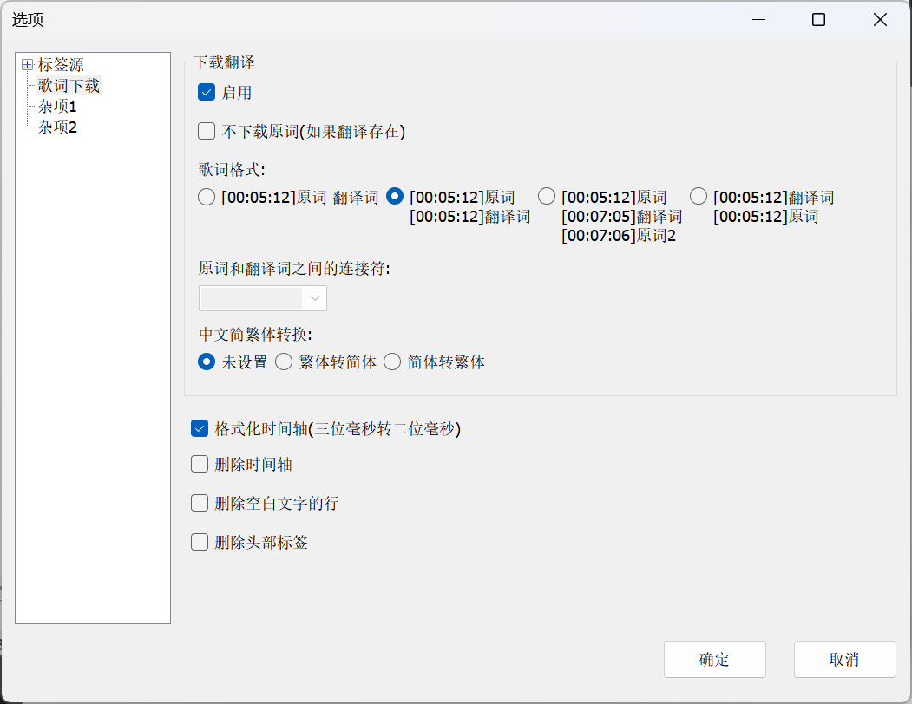

# 音乐标签

## 应用 SPW 支持的歌词翻译

为了获得更好的歌词阅读体验，可将歌词格式设置为同时显示原文和翻译。

1. 在顶部菜单栏中，点击“工具”，然后选择“选项”
2. 在“选项”对话框中，从左侧菜单选择“歌词下载”
3. 在“下载翻译”区域，找到“歌词格式”并选择“格式二”

```
[00:05.12]原词
[00:05.12]翻译词
```



## 参考

[SPL 格式（Salt Player Lyrics）语法标准](/standards/spl)