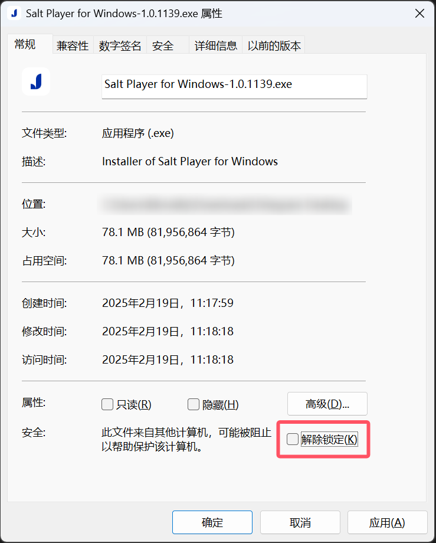

# FAQ

## 无法启动安装程序？

检查是否将安装程序（EXE 文件）的属性设置了安全锁定，见下图：

尝试勾选“解除锁定”应用后重新运行安装程序。

## 安装缓慢？

安装包会请求 UAC，也可能是因为存在 Windows 安全中心云端检查信誉，参考来源：

- https://bbs.pcbeta.com/viewthread-2018233-1-1.html

## 蓝屏 0x116_IMAGE_nvlddmkm.sys？

由 ​NVIDIA 显卡驱动（nvlddmkm.sys）引发的 ​VIDEO_TDR_FAILURE (116) 错误，属于显卡驱动与系统交互失败导致的保护性崩溃，尝试更新显卡驱动。

## 卸载遇到“无法使用此产品的安装源，请确认安装源存在，并且你可以访问它。”

下载微软官方的 MSI 安装包修复程序：

- https://support.microsoft.com/en-us/topic/fix-problems-that-block-programs-from-being-installed-or-removed-cca7d1b6-65a9-3d98-426b-e9f927e1eb4d

## 安装报错“Error writing to file: xxx. Verify that you have access to that directory.”

权限问题，确保授予 UAC 权限，另外检查是否有第三方安全软件（可尝试关闭某些安全软件并重试安装）阻止了安装包写入安装目录。